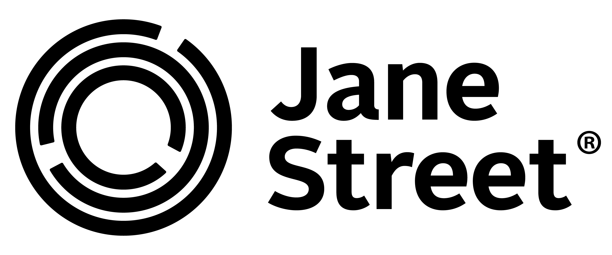
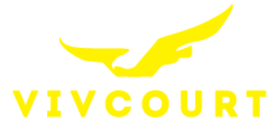
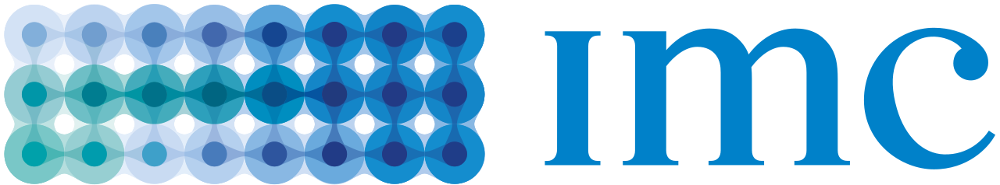
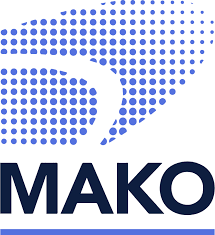

# Major Sponsors

Citadel Securities is a leading global market maker, delivering a broad array of fixed income and equity products to banks, broker-dealers, government agencies, corporations, insurers, and sovereign wealth funds. Through innovation and efficiency, the firm provides liquidity with the goal of driving price discovery in more than 35 countries and making markets more competitive, open, and transparent. Since its founding more than 15 years ago, Citadel Securities has cultivated a culture of excellence, assembling the brightest minds in trading, technology, and the sciences to make better markets for a better world.

Jane Street is a quantitative trading firm with offices worldwide. We hire smart, humble people who love to solve problems, build systems, and test theories. You’ll learn something new every day in our office—whether it’s connecting with a colleague to share perspectives, or participating in a talk, class, or game night. Our success is driven by our people and we never stop improving.

# Minor Sponsors

Optiver is a tech-driven trading firm and leading global market maker. For over 35 years, Optiver has been improving financial markets around the world, making them more transparent and efficient for all participants. The firm looks for the brightest students, who are passionate about problem solving and have a motivation to succeed. Regardless of whether you join as a grad or an intern, you'll be supported in their industry-leading training programs to excel and make an impact on the real world.

To learn more about Optiver’s Graduate and Internship Program opportunities, [our website](https://optiver.com/working-at-optiver/graduate-and-student/).

We use technology and data to trade diverse assets and execute various trading strategies on the world’s financial markets.

Employee wellbeing and growth is at the heart of our ethos and we create a positive impact by sharing our profits and our purposefully chosen social causes with our people.

Susquehanna is a global quantitative trading firm founded by a group of friends who share a passion for game theory and probabilistic thinking. Our rigorous and analytical approach to decision making has led Susquehanna to become one of the largest and most successful proprietary trading firms in the world. In our offices around the globe, our employees are relentless problem solvers who collaborate to make optimal decisions.

As a leading, global market maker, IMC trades on more than 100 venues and provides liquidity in more than 200,000 securities. Using innovative technology and advanced trading strategies, we've played our part in making financial markets more efficient for almost 30 years.

Across offices, diverse teams of traders, developers and technologists work together to design and develop the software, hardware, networks and algorithms that drive our strategies and make us one of the world’s leading liquidity providers. We hire independent thinkers and challenge them to anticipate change and continuously innovate, seeking new ways to sustain our success. At IMC, anyone can make an impact and everyone is encouraged to do so.

We make markets in exchange-traded fixed income, equities and commodities products, providing liquidity to major exchanges in Europe, APAC and the Americas. Our reputation is built upon our consistent provision of liquidity across all market cycles, especially periods of high market stress.

Now, a large percentage of our global workforce is dedicated to designing, building, optimizing and maintaining our latency sensitive proprietary trading systems. Our success in this journey is underpinned by our expertise developed over the last 20 years as well as our entrepreneurial and collaborative culture. We are proud of our history, however we firmly believe that our commitment to rapid innovation and support of intellectual curiosity means that our best days are ahead of us.

# Affiliate Sponsors

    

        
    

    

        
    

